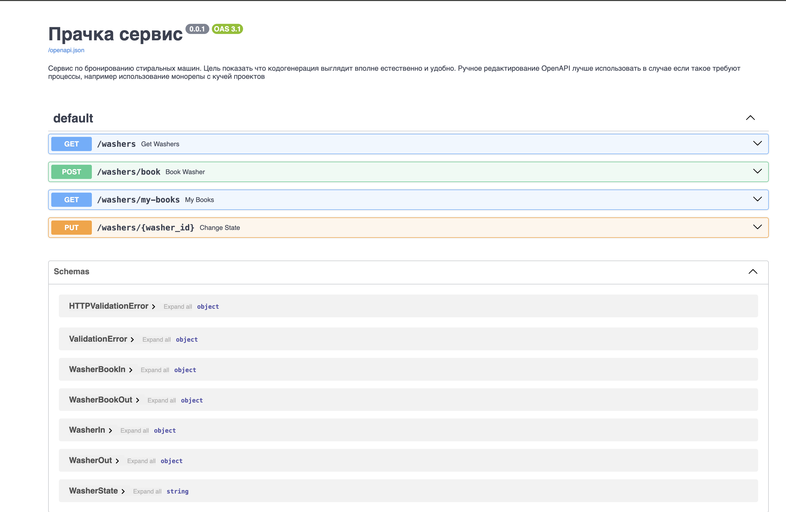
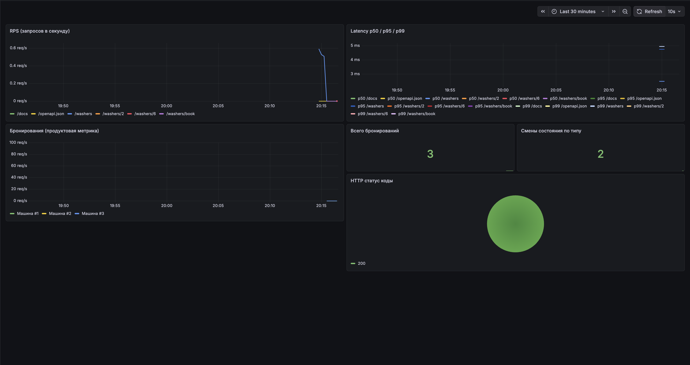
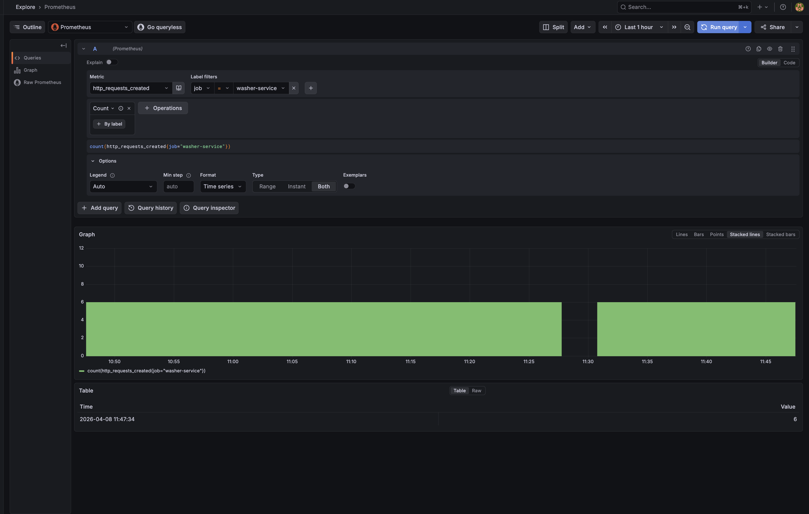
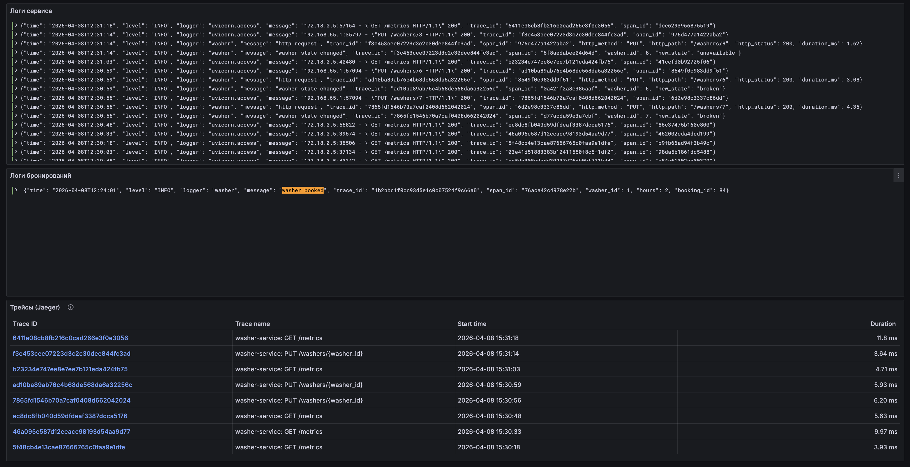
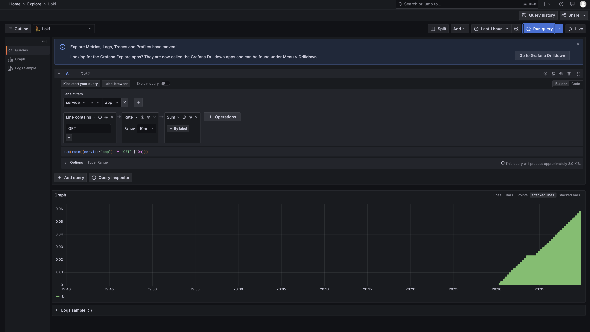
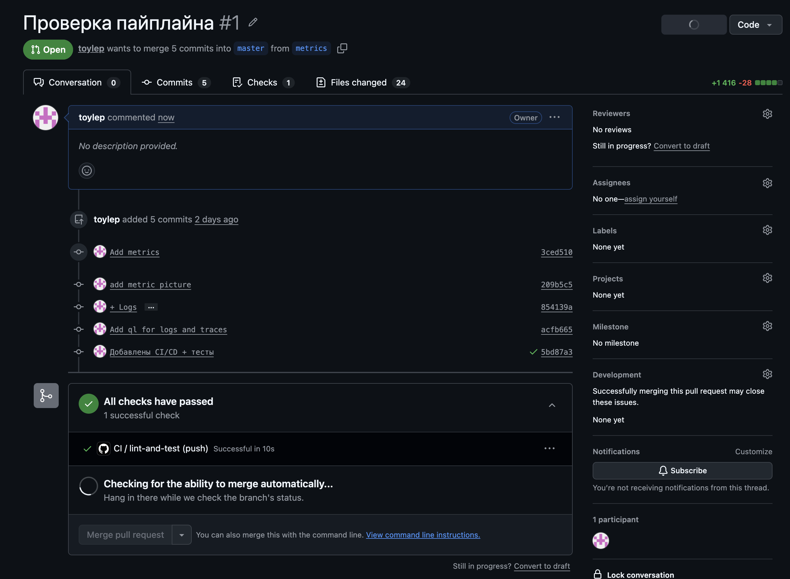

# Прачка сервис (Washer Booking Service)

Мини-сервис бронирования стиральных машин, реализованный на FastAPI.
Проект демонстрирует, как удобно использовать автоматическую генерацию OpenAPI-схемы и Pydantic-моделей без ручного описания API.

## Описание

Сервис предоставляет простой REST API для:
	•	просмотра списка стиральных машин
	•	бронирования стиральной машины
	•	просмотра своих бронирований
	•	изменения состояния машины (администраторская функция)

FastAPI автоматически генерирует OpenAPI спецификацию и Swagger UI, что делает кодогенерацию API естественной и удобной.

Технологии
	•	Python 3.10+
	•	FastAPI
	•	Pydantic
	•	Uvicorn
	•	Graphana
	•	Loki
	•	Prometheus


## Установка и запуск
Устанавливается с помощью uv 
```
uv sync
uv run uvicorn main:app --reload
```
Swagger будет развернут по url http://localhost:8000/docs


## Метрики логи и трейсы
Graphana развернута по url http://localhost:3000/
Метрики берутся из prometheus http://localhost:9000/


Язык запросов


Логи берутся из Loki а трейсы из jaeger


Язык запросов


## CI/CD
Добавлен пайплайн для прогона тестов и линтеры
